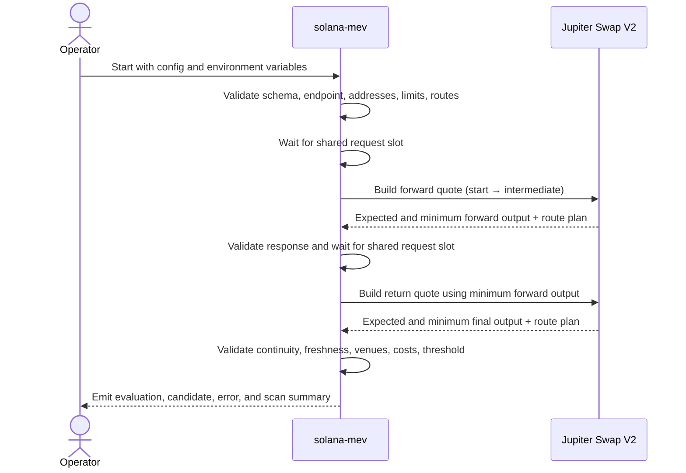

# Solana Arbitrage Monitor

[](https://github.com/x89/Solana-Arbitrage-Bot/actions/workflows/ci.yml)
[](rust-toolchain.toml)
[](LICENSE)

A production-minded, observation-only service for evaluating configured
cyclic-arbitrage routes on Solana through Jupiter Swap V2. It discovers and
scores round trips without loading private keys, connecting to Solana RPC, or
submitting transactions.

> [!IMPORTANT]
> **Supported scope — 17 July 2026:** `solana-mev` is the repository's only
> maintained product. It is a quote monitor for research and operational
> telemetry—not a trading engine. Everything under `legacy/` is archived,
> excluded from CI and releases, and unsafe for funded use.

## At a glance

| Area | Current contract |
| --- | --- |
| Product | Read-only two-leg cyclic-arbitrage monitor |
| Market access | Jupiter Swap V2 `/build` quotes |
| Execution | Intentionally absent |
| Credentials | Jupiter API key plus an unfunded public taker address |
| Runtime | Rust 1.89+, Tokio, rustls |
| Output | Human-readable or newline-delimited JSON logs |
| Quality | 20 deterministic tests, strict Clippy, RustSec and cargo-deny |
| Release pipeline | Signed-tag builds for Linux x86-64 and Apple Silicon macOS |

## Contents

- [Supported product](#supported-product)
- [Safety boundary](#safety-boundary)
- [Architecture](#architecture)
- [Opportunity calculation](#opportunity-calculation)
- [Quick start](#quick-start)
- [Configuration](#configuration)
- [Operating the monitor](#operating-the-monitor)
- [Reliability and security controls](#reliability-and-security-controls)
- [Engineering workflow](#engineering-workflow)
- [Operations and releases](#operations-and-releases)
- [Repository layout](#repository-layout)
- [Known limitations](#known-limitations)
- [Legacy workspaces](#legacy-workspaces)
- [Execution roadmap](#execution-roadmap)
- [Troubleshooting](#troubleshooting)

## Supported product

For each enabled route, the monitor:

1. Requests a Jupiter Swap V2 quote from the configured start mint to an
   intermediate mint.
2. Uses the forward quote's **minimum output**, rather than its optimistic
   expected output, as the input amount for the return quote.
3. Requests a second quote from the intermediate mint back to the start mint.
4. Subtracts the configured estimated execution cost from the minimum final
   amount.
5. Checks the resulting profit against the configured basis-point threshold.
6. Optionally rejects routes whose two legs use any of the same Jupiter
   `ammKey` liquidity-source accounts.
7. Discards the result if the complete two-quote cycle exceeds its configured
   freshness deadline.
8. Logs either a normal route evaluation or a candidate opportunity.

The implementation is deliberately narrow: route discovery and conservative
evaluation are supported; transaction construction and execution are not.
Jupiter's `/swap/v2/build` response is treated as untrusted input and validated
before any value contributes to an opportunity decision.

## Safety boundary

The supported monitor:

- does **not** read a Solana keypair, seed phrase, or private key;
- does **not** create, sign, simulate, or submit transactions;
- does **not** send Jito bundles or tips;
- does **not** connect to a Solana RPC endpoint;
- does **not** create token accounts or wrap SOL;
- does **not** perform sandwich trading, front-running, or copy trading;
- does **not** promise that a logged candidate is executable or profitable.

Only a public Solana address is supplied to Jupiter as the `taker`. Never put a
private key or seed phrase in `SOLANA_TAKER_PUBKEY`.

## Architecture



The monitor evaluates routes sequentially. All Jupiter requests share one
request gate, so adding routes does not bypass the configured API-rate limit.
Each route is failure-isolated except for denied API access (`401`/`403`),
which stops the active scan immediately.

### Design decisions

- **Conservative composition:** the return leg consumes the forward leg's
  minimum output, not its optimistic quote.
- **Integer economics:** all amounts and threshold comparisons use base-unit
  integer arithmetic.
- **Strict boundaries:** unknown configuration fields, non-official endpoints,
  malformed AMM keys, and out-of-policy DEX responses fail closed.
- **Deterministic testability:** Jupiter transport and quote evaluation are
  exercised with local mocks and fake providers; tests never require mainnet.
- **Operational transparency:** each event carries scan context, and each pass
  ends with a structured summary.

## Opportunity calculation

All amounts are integers in the smallest unit of the route's start mint.
Floating-point UI amounts are never used.

For a route with start amount `S`, estimated cost `C`, and the return quote's
minimum output `F`:

```text
estimated_net_profit = F - S - C
```

A route can be marked as a candidate only when:

```text
estimated_net_profit > 0

and

estimated_net_profit × 10,000
    >= S × min_profit_bps
```

The threshold is compared with integer cross-multiplication, avoiding the
rounding error that would otherwise allow a small loss to appear as zero basis
points.

When `require_different_venues = true`, the forward and return route plans must
also have disjoint Jupiter `ammKey` sets. Human-readable DEX labels are logged,
but they are not used as proof of pool independence.

This calculation is intentionally conservative about first-leg slippage, but it
is still only a sequential quote estimate. Market movement between requests,
transaction fees, account state changes, and transaction construction can make
the real result materially different.

## Quick start

### Prerequisites

- `rustup`; the repository pins Rust 1.89.0 with rustfmt and Clippy.
- A Jupiter API key from <https://portal.jup.ag>.
- An unfunded public Solana address for Jupiter's required `taker` parameter.
- Internet access to `https://api.jup.ag`.

Anchor, the Solana CLI, a Solana RPC URL, and a funded wallet are not required
for the supported monitor.

### Validate and run one scan

Run commands from the repository root:

```bash
export JUPITER_API_KEY="your-jupiter-api-key"
export SOLANA_TAKER_PUBKEY="your-public-solana-address"

cargo run --package mev-bot-solana -- \
  --config solana-mev/config.toml --validate-config

cargo run --release --package mev-bot-solana -- \
  --config solana-mev/config.toml --once
```

Configuration validation does not read credentials or call Jupiter. `--once`
evaluates every enabled route once and returns non-zero if any route fails.

### Run continuously

```bash
export JUPITER_API_KEY="your-jupiter-api-key"
export SOLANA_TAKER_PUBKEY="your-public-solana-address"

cargo run --release --package mev-bot-solana -- \
  --config solana-mev/config.toml
```

The application does not load `.env` files automatically. Inject environment
variables through the shell, service manager, container runtime, or secret
manager.

## Configuration

The default configuration is
[`solana-mev/config.toml`](solana-mev/config.toml). Unknown fields are rejected
instead of being silently ignored, so spelling mistakes fail at startup.
`schema_version = 1` is required, making incompatible future configuration
changes explicit.

Validate configuration structure and values without setting credentials or
calling Jupiter:

```bash
cargo run --package mev-bot-solana -- \
  --config solana-mev/config.toml --validate-config
```

### Jupiter settings

| Field | Default | Contract |
| --- | --- | --- |
| `base_url` | Official Swap V2 URL | Must use the official `https://api.jup.ag/swap/v2` origin and path; alternate hosts or ports, credentials, query strings, fragments, and non-HTTPS URLs are rejected. |
| `api_key_env` | `JUPITER_API_KEY` | Environment-variable name containing the API key. Never place the key itself in TOML. |
| `taker_env` | `SOLANA_TAKER_PUBKEY` | Environment-variable name containing an unfunded public Solana address. |
| `request_timeout_ms` | `5000` | Per-request timeout; accepted range `100..=60000`. |
| `min_request_interval_ms` | `1100` | Shared delay between request starts; accepted range `0..=60000`. Set this from the quota shown in the Jupiter portal. |

### Scanner settings

| Field | Default | Contract |
| --- | --- | --- |
| `interval_ms` | `1000` | Delay after a completed scan; minimum `100`. |
| `min_profit_bps` | `30` | Required estimated net profit (`30` = `0.30%`); range `0..=10000`. Profit must remain strictly positive at zero. |
| `slippage_bps` | `30` | Slippage sent to both quote requests; must be below `10000`. |
| `max_accounts` | `64` | Jupiter route-account limit; range `1..=64`. |
| `fast_mode` | `true` | Sends `mode=fast` to Jupiter. |
| `require_different_venues` | `true` | Requires disjoint forward and return `ammKey` sets. This is a filter, not proof of economic independence. |
| `max_cycle_duration_ms` | `15000` | Cancels stale quote cycles; range `100..=300000` and must exceed `min_request_interval_ms`. |

### Route settings

Each `[[routes]]` block defines one cycle:

| Field | Contract |
| --- | --- |
| `name` | Unique, non-empty, trimmed identifier used in logs. |
| `start_mint` | Asset supplied at the start and expected after the return leg. |
| `intermediate_mint` | Asset between the two legs; must differ from `start_mint`. |
| `amount` | Positive integer in start-mint base units. For six-decimal USDC, `100000000` means 100 USDC. |
| `estimated_cost_in_start_units` | Manual cost allowance in start-mint base units; must be below `amount`. Include realistic priority fees, tips, transfer fees, rent, and wrapping costs. |
| `forward_dexes`, `return_dexes` | Optional exact Jupiter DEX labels. Empty arrays allow any supported venue. |
| `enabled` | Includes the route in scans. At least one route must be enabled. |

The maintained, commented example is
[`solana-mev/config.toml`](solana-mev/config.toml). Treat cost allowances as
operator assumptions, not guarantees.

## Operating the monitor

### Command reference

| Option | Behavior |
| --- | --- |
| `--config <PATH>` | Loads a specific TOML file. The CLI default is `config.toml` relative to the current directory. |
| `--validate-config` | Validates TOML without credentials or network access. |
| `--once` | Evaluates each enabled route once and exits. |
| `--log-format human` | Emits terminal-oriented tracing output. |
| `--log-format json` | Emits newline-delimited structured events. |

Enable request-level diagnostic logging:

```bash
RUST_LOG=debug cargo run --package mev-bot-solana -- \
  --config solana-mev/config.toml --once
```

Emit newline-delimited JSON for log collection:

```bash
cargo run --release --package mev-bot-solana -- \
  --config solana-mev/config.toml --log-format json
```

Display command-line help:

```bash
cargo run --package mev-bot-solana -- --help
```

### Event model

The logging contract is identical in human and JSON modes:

| Event | Level | Key fields |
| --- | --- | --- |
| Route evaluation | `INFO` | `scan_id`, route, profit basis points, minimum final amount, venues, cycle duration |
| Candidate opportunity | `WARN` | Evaluation fields plus start amount, expected/minimum intermediate and final amounts, estimated net profit |
| Route failure | `ERROR` | `scan_id`, route, and complete contextual error chain |
| Scan summary | `INFO` | Route, error, candidate, and elapsed-time counts |

Logs never include the Jupiter API key. Treat candidate events as telemetry,
not orders, recommendations, or profit guarantees.

## Reliability and security controls

The maintained monitor includes the following safeguards:

- The Jupiter API key is read only from a named environment variable.
- The API endpoint is pinned to the official HTTPS Swap V2 origin and path.
- HTTP redirects are disabled to prevent forwarding the custom API-key header
  to another origin.
- API response bodies are streamed with a two-megabyte maximum.
- Response mints, input amount, swap mode, slippage, route plan, and output
  thresholds are validated before use.
- Configuration values, Solana addresses, route names, and DEX labels are
  validated at startup.
- A required schema version prevents silent configuration drift.
- Requests are serialized through a shared minimum-interval gate.
- Jupiter's absolute `x-ratelimit-reset` timestamp is preferred for `429`
  responses; delta-seconds and HTTP-date `Retry-After` remain supported
  fallbacks. Reported delays are honored up to five minutes.
- Quote cycles are cancelled at `max_cycle_duration_ms`; stale cycles are
  rejected.
- Fully failed scans use exponential backoff capped at 60 seconds.
- Jupiter `401` and `403` responses stop the active scan immediately instead
  of sending more requests with denied access.
- Error logs include the complete context chain while never logging the API
  key.
- `Ctrl-C` cancels either an active scan or the inter-scan wait cleanly.
- CI checks the MSRV and latest stable Rust, tests, strict Clippy, RustSec,
  license/source policy, changed commits for secrets, and the full repository
  history on a weekly or manually triggered scan.

## Engineering workflow

The root workspace contains only the supported crate. Before opening a pull
request, run:

```bash
cargo fmt --all -- --check
cargo check --workspace --all-targets --all-features --locked
cargo test --workspace --all-targets --all-features --locked
cargo clippy --workspace --all-targets --all-features --locked -- -D warnings
```

Dependency audit:

```bash
cargo install cargo-audit --locked
cargo audit
cargo install cargo-deny --locked
cargo deny check
```

Verified on 17 July 2026:

- formatting passes;
- all targets and features compile on Rust 1.89 and latest stable;
- 13 unit tests and 7 deterministic integration tests pass;
- strict Clippy passes with warnings denied;
- rustdoc and optimized release builds pass;
- the supported workspace lockfile has no RustSec vulnerabilities.

Integration tests use a local mock HTTP server and a fake quote provider. They
cover request construction, response parsing, redirects, bounded bodies,
rate-limit metadata, request serialization, conservative leg chaining,
liquidity-source separation, cost deductions, and stale-cycle rejection
without depending on live mainnet state.

These checks validate the off-chain monitor only. They do not certify that a
candidate is executable, validate mainnet liquidity, or make the archived CPI
programs safe.

Contribution policy, required checks, and scope rules are documented in
[`CONTRIBUTING.md`](CONTRIBUTING.md). Security issues must follow
[`SECURITY.md`](SECURITY.md).

## Operations and releases

See [`docs/OPERATIONS.md`](docs/OPERATIONS.md) for protected-branch settings,
credential-incident actions, deployment checks, health signals, rollback, and
the release procedure. Repository source cannot revoke a provider credential
or enable GitHub branch protection; the owner must complete and verify those
two controls.

Signed tags matching `v<crate-version>` on the default branch build Linux
x86-64 and Apple Silicon macOS archives. The release workflow reruns quality
gates, publishes SHA-256 checksums and GitHub build-provenance attestations, and
rejects a tag that does not match the Cargo package version.

Release notes are maintained in [`CHANGELOG.md`](CHANGELOG.md). The complete
deployment, health, shutdown, rollback, and release procedure is in
[`docs/OPERATIONS.md`](docs/OPERATIONS.md).

## Repository layout

```text
.
├── solana-mev/          # Supported Rust monitor, configuration, and tests
├── docs/                # Operations and archived design material
├── legacy/              # Quarantined historical prototypes
├── .github/             # CI, release, ownership, and dependency automation
├── Cargo.toml           # Root workspace: solana-mev only
├── Cargo.lock           # Reproducible supported dependency graph
├── rust-toolchain.toml  # Rust 1.89, rustfmt, and Clippy
├── MIGRATION.md         # Dated protocol and dependency findings
└── SECURITY.md          # Supported surface and disclosure policy
```

The workspace boundary is intentional. Cargo commands from the repository root
do not build or test archived manifests.

## Known limitations

- Quotes are sequential rather than atomic, even with the freshness deadline.
- No exact transaction is assembled or simulated.
- No recent-blockhash, account-lock, or address-lookup-table behavior is
  tested.
- Estimated cost is configured manually and can be too low.
- Token-2022 transfer-fee behavior is not calculated by the monitor.
- Creating an ATA, wrapping SOL, priority fees, and Jito tips can materially
  change profitability.
- API route availability does not guarantee that the same route remains
  available at transaction execution time.
- Requiring disjoint `ammKey` sets is a useful filter, not proof of independent
  price formation.
- Tests are deterministic and offline; there is intentionally no funded or
  live-mainnet execution test.

## Legacy workspaces

The following directories remain under `legacy/` for historical analysis only
and are excluded from the root Cargo workspace, CI, and releases.

### `legacy/client-pool`

- Uses an obsolete Solana 1.9 / Anchor 0.22 dependency stack.
- Contains retired Serum and Orca Token Swap models.
- Models Jupiter incorrectly as a static pool.
- Does not currently build because its missing CPI dependency cannot be safely
  replaced by a newer, ABI-incompatible program.
- Mainnet transaction construction and helper scripts are disabled.

### `legacy/arbitrage`

- Contains incompatible Anchor and Solana dependency generations.
- Uses invalid or inconsistent program identities.
- Has incomplete account constraints, instruction encoders, and profit checks.
- Its former key-reading integration test is archived and never discovered by
  the maintained test runner.
- Deployment helper scripts are disabled.

### `legacy/solana-program`

- Host compilation succeeds on a pinned legacy stack.
- Its direct Orca, Raydium, Jupiter, and Meteora calls do not conform to current
  protocol instruction/account layouts.
- A successful host build is not evidence that a CPI is safe or functional on
  mainnet.
- Deployment helper scripts are disabled.

The legacy Rust and Node lockfiles contain known security advisories. Updating
individual transitive packages cannot repair obsolete protocol semantics. See
[`MIGRATION.md`](MIGRATION.md) for the detailed findings.

## Execution roadmap

Funded execution is a separate product and security boundary, not a feature
toggle for this monitor. A future executor would require, at minimum:

1. Consume current protocol-returned instructions and address lookup tables.
2. Compose both legs into one versioned transaction.
3. Add a final on-chain minimum-balance or minimum-output invariant.
4. Verify token mints, owners, token programs, and route continuity.
5. Support both the SPL Token program and explicitly approved Token-2022
   extensions.
6. Include priority fees, Jito tips, transfer fees, rent, and SOL wrapping in
   the invariant.
7. Simulate the exact signed message against the intended RPC endpoint.
8. Compare pre- and post-transaction token balances.
9. Enforce maximum position size, loss limits, stale-quote limits, and circuit
   breakers.
10. Run in shadow mode before any funded rollout.
11. Add current-protocol integration tests and an independent security review.

Jito bundle acceptance alone is not proof of landing or profitability. Bundle
handling must account for rejection, expiration, and uncled-block behavior.

## Troubleshooting

### `JUPITER_API_KEY` is required

Export the variable named by `jupiter.api_key_env`:

```bash
export JUPITER_API_KEY="your-jupiter-api-key"
```

Do not place the key directly in `config.toml`.

### `SOLANA_TAKER_PUBKEY` is required or invalid

Set it to a public 32-byte Solana address:

```bash
export SOLANA_TAKER_PUBKEY="your-public-solana-address"
```

Do not provide a filesystem path, JSON keypair, seed phrase, or private key.

### Jupiter returns `401` or `403`

`401` normally means that the API key is missing, invalid, or expired. `403`
can also mean that the key lacks endpoint permission or that Jupiter's firewall
blocked access. The monitor stops immediately; check credentials, portal
permissions, and network/firewall policy.

### Jupiter returns `429`

The configured request rate exceeds the account's quota. Keep
`min_request_interval_ms = 1100` for the free tier, reduce the number of
external consumers using the same key, or configure a value appropriate for
the paid plan shown in the Jupiter portal.

### Configuration fails with an unknown field

Configuration parsing is intentionally strict. Compare the field name with
`solana-mev/config.toml`; a misspelled field is rejected rather than defaulting
silently.

### No candidate opportunities are logged

This is expected under normal market conditions. Check:

- the route amount and token decimals;
- `min_profit_bps`;
- the per-route estimated cost;
- optional DEX restrictions;
- whether `require_different_venues` rejects reused liquidity sources;
- API errors at `RUST_LOG=debug`.

Do not reduce safety margins merely to produce candidate logs.

### The legacy crate does not build

This is intentional quarantine, not a supported setup issue. Do not repoint
path dependencies or upgrade isolated Anchor crates and assume the result is
mainnet-compatible. Use `solana-mev` or perform a protocol-specific rewrite.

## License

This repository is provided under the terms in [`LICENSE`](LICENSE).
