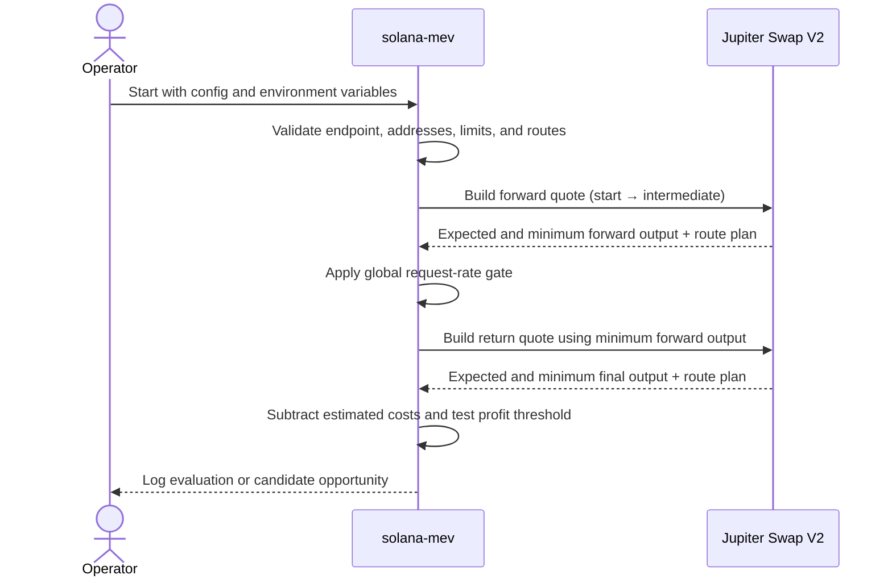

# Solana Arbitrage Monitor

A safety-first, observation-only cyclic-arbitrage monitor for Solana. The
supported implementation uses Jupiter Swap V2 to evaluate configured
round-trip routes without loading a private key, signing a transaction, or
submitting anything on-chain.

> **Project status — July 2026**
>
> `solana-mev` is the only maintained and supported component. It is suitable
> for quote monitoring and engineering research, not funded execution. The
> other workspaces are archived prototypes with obsolete protocol integrations
> and must not be deployed or funded.

## Contents

- [What this project does](#what-this-project-does)
- [Safety boundary](#safety-boundary)
- [Architecture](#architecture)
- [Opportunity calculation](#opportunity-calculation)
- [Repository layout](#repository-layout)
- [Requirements](#requirements)
- [Quick start](#quick-start)
- [Configuration](#configuration)
- [Running the monitor](#running-the-monitor)
- [Understanding the output](#understanding-the-output)
- [Reliability and security controls](#reliability-and-security-controls)
- [Verification](#verification)
- [Known limitations](#known-limitations)
- [Legacy workspaces](#legacy-workspaces)
- [Path to transaction execution](#path-to-transaction-execution)
- [Troubleshooting](#troubleshooting)

## What this project does

For each enabled route, the monitor:

1. Requests a Jupiter Swap V2 quote from the configured start mint to an
   intermediate mint.
2. Uses the forward quote's **minimum output**, rather than its optimistic
   expected output, as the input amount for the return quote.
3. Requests a second quote from the intermediate mint back to the start mint.
4. Subtracts the configured estimated execution cost from the minimum final
   amount.
5. Checks the resulting profit against the configured basis-point threshold.
6. Optionally rejects routes whose two legs use any of the same Jupiter
   `ammKey` liquidity-source accounts.
7. Logs either a normal route evaluation or a candidate opportunity.

The monitor uses the current Jupiter `/swap/v2/build` response for routing
information. Although that endpoint also returns transaction instructions, this
project deliberately ignores those instructions and performs no execution.

## Safety boundary

The supported monitor:

- does **not** read a Solana keypair, seed phrase, or private key;
- does **not** create, sign, simulate, or submit transactions;
- does **not** send Jito bundles or tips;
- does **not** connect to a Solana RPC endpoint;
- does **not** create token accounts or wrap SOL;
- does **not** perform sandwich trading, front-running, or copy trading;
- does **not** promise that a logged candidate is executable or profitable.

Only a public Solana address is supplied to Jupiter as the `taker`. Never put a
private key or seed phrase in `SOLANA_TAKER_PUBKEY`.

## Architecture



The monitor evaluates routes sequentially. All Jupiter requests share one
request gate, so adding routes does not bypass the configured API-rate limit.

## Opportunity calculation

All amounts are integers in the smallest unit of the route's start mint.
Floating-point UI amounts are never used.

For a route with start amount `S`, estimated cost `C`, and the return quote's
minimum output `F`:

```text
estimated_net_profit = F - S - C
```

A route can be marked as a candidate only when:

```text
estimated_net_profit > 0

and

estimated_net_profit × 10,000
    >= S × min_profit_bps
```

The threshold is compared with integer cross-multiplication, avoiding the
rounding error that would otherwise allow a small loss to appear as zero basis
points.

When `require_different_venues = true`, the forward and return route plans must
also have disjoint Jupiter `ammKey` sets. Human-readable DEX labels are logged,
but they are not used as proof of pool independence.

This calculation is intentionally conservative about first-leg slippage, but it
is still only a sequential quote estimate. Market movement between requests,
transaction fees, account state changes, and transaction construction can make
the real result materially different.

## Repository layout

- `solana-mev/` — maintained Rust monitor and the only supported runnable
  component.
- `MIGRATION.md` — dated protocol, dependency, and migration findings.
- `client-pool/` — archived Solana 1.9 / Anchor 0.22 pool-client experiment.
- `arbitrage/` — archived, non-buildable direct-CPI arbitrage prototype.
- `solana-program/` — archived Anchor program that host-compiles on a pinned
  legacy stack but does not implement valid current-mainnet CPIs.
- `*.mermaid` — legacy conceptual diagrams, explicitly marked as such. The
  architecture in this README describes the supported monitor.

## Requirements

- Rust 1.89 or newer.
- A Jupiter API key from <https://portal.jup.ag>.
- A valid public Solana wallet address for Jupiter's required `taker`
  parameter.
- Internet access to `https://api.jup.ag`.

Anchor, the Solana CLI, a Solana RPC URL, and a funded wallet are not required
for the supported monitor.

## Quick start

```bash
cd solana-mev

export JUPITER_API_KEY="your-jupiter-api-key"
export SOLANA_TAKER_PUBKEY="your-public-solana-address"

cargo run --release -- --once
```

The `--once` command evaluates every enabled route once and exits. It returns a
non-zero status if a route evaluation fails, making it suitable for manual
checks and controlled automation.

For continuous monitoring:

```bash
cd solana-mev
export JUPITER_API_KEY="your-jupiter-api-key"
export SOLANA_TAKER_PUBKEY="your-public-solana-address"
cargo run --release
```

## Configuration

The default configuration is
[`solana-mev/config.toml`](solana-mev/config.toml). Unknown fields are rejected
instead of being silently ignored, so spelling mistakes fail at startup.

### Jupiter settings

`base_url`

- Must be the official `https://api.jup.ag/swap/v2` endpoint.
- Credentials, query strings, fragments, alternate hosts, and non-HTTPS URLs
  are rejected.

`api_key_env`

- Name of the environment variable containing the Jupiter API key.
- Defaults to `JUPITER_API_KEY`.
- The secret itself must never be written to the TOML file.

`taker_env`

- Name of the environment variable containing the public Solana taker address.
- Defaults to `SOLANA_TAKER_PUBKEY`.

`request_timeout_ms`

- Timeout for each Jupiter HTTP request.
- Must be at least 100 milliseconds.
- Default: `5000`.

`min_request_interval_ms`

- Minimum delay between the start of any two Jupiter requests.
- Shared across every route and both quote legs.
- Default: `1100`, which is intended to remain below Jupiter Free's documented
  one-request-per-second limit.
- Paid plans may use a lower value consistent with their portal quota.
- Maximum accepted value: `60000`.

### Scanner settings

`interval_ms`

- Delay after a completed scan before the next scan begins.
- This is separate from the per-request Jupiter rate gate.
- Minimum: `100`.
- Default: `1000`.

`min_profit_bps`

- Minimum estimated net profit in basis points.
- `30` means `0.30%`.
- Allowed range: `0` through `10000`.
- Net profit must still be strictly positive when this value is zero.

`slippage_bps`

- Slippage tolerance sent to each Jupiter quote request.
- `30` means `0.30%`.
- Must be less than `10000`.

`max_accounts`

- Maximum account count requested from Jupiter for a route.
- Allowed range: `1` through `64`.

`fast_mode`

- Sends `mode=fast` to Jupiter when enabled.
- Default: `true`.

`require_different_venues`

- Requires disjoint `ammKey` sets between the forward and return legs.
- This reduces obvious self-reuse of the same liquidity source.
- It does not prove that the routes are economically independent.

### Route settings

Each `[[routes]]` block defines one cycle:

`name`

- Unique, non-empty, whitespace-trimmed identifier used in logs.

`start_mint`

- Solana mint address of the asset supplied at the start and expected at the
  end of the cycle.

`intermediate_mint`

- Solana mint address quoted between the two legs.
- Must differ from `start_mint`.

`amount`

- Positive integer amount in the start mint's smallest unit.
- Example: USDC has six decimals, so `100000000` represents 100 USDC.

`estimated_cost_in_start_units`

- Estimated total execution cost expressed in the start mint's smallest unit.
- Must be smaller than `amount`.
- It should account for realistic priority fees, Jito tips, Token-2022
  transfer fees, ATA rent, wrapping/unwrapping costs, and other execution
  overhead.
- This is an operator estimate, not a safety guarantee.

`forward_dexes` and `return_dexes`

- Optional lists of exact Jupiter DEX labels.
- Empty lists allow Jupiter to use any supported venue.
- Values must be non-empty, trimmed, unique, and must not contain commas.

`enabled`

- Controls whether the route is evaluated.
- At least one route must be enabled.

Example:

```toml
[jupiter]
base_url = "https://api.jup.ag/swap/v2"
api_key_env = "JUPITER_API_KEY"
taker_env = "SOLANA_TAKER_PUBKEY"
request_timeout_ms = 5000
min_request_interval_ms = 1100

[scanner]
interval_ms = 1000
min_profit_bps = 30
slippage_bps = 30
max_accounts = 64
fast_mode = true
require_different_venues = true

[[routes]]
name = "USDC-WSOL-USDC"
start_mint = "EPjFWdd5AufqSSqeM2qN1xzybapC8G4wEGGkZwyTDt1v"
intermediate_mint = "So11111111111111111111111111111111111111112"
amount = 100000000
estimated_cost_in_start_units = 10000
forward_dexes = []
return_dexes = []
enabled = true
```

## Running the monitor

Run once with the default configuration:

```bash
cd solana-mev
cargo run --release -- --once
```

Use a different configuration:

```bash
cargo run --release -- --config /absolute/path/to/config.toml --once
```

Run continuously:

```bash
cargo run --release
```

Enable request-level diagnostic logging:

```bash
RUST_LOG=debug cargo run --release -- --once
```

Display command-line help:

```bash
cargo run --release -- --help
```

## Understanding the output

Normal evaluations are logged at `INFO` level and include:

- route name;
- estimated profit in basis points;
- minimum final amount;
- forward and return DEX labels;
- whether the underlying `ammKey` sets are disjoint.

Candidate opportunities are logged at `WARN` level and additionally include:

- start amount;
- expected and minimum intermediate amounts;
- expected and minimum final amounts;
- estimated net profit in start-mint base units.

Request or schema failures are logged at `ERROR` level with their full error
cause chain. A candidate log means only that two sequential API responses
satisfied the configured rules. It is not an execution recommendation or
profit guarantee.

## Reliability and security controls

The maintained monitor includes the following safeguards:

- The Jupiter API key is read only from a named environment variable.
- The API endpoint is pinned to the official HTTPS Swap V2 origin and path.
- HTTP redirects are disabled to prevent forwarding the custom API-key header
  to another origin.
- API response bodies are streamed with a two-megabyte maximum.
- Response mints, input amount, swap mode, slippage, route plan, and output
  thresholds are validated before use.
- Configuration values, Solana addresses, route names, and DEX labels are
  validated at startup.
- Requests are serialized through a shared minimum-interval gate.
- `Retry-After` is honored up to five minutes.
- Fully failed scans use exponential backoff capped at 60 seconds.
- Jupiter `401` and `403` responses stop continuous monitoring instead of
  retrying invalid credentials forever.
- Error logs include the complete context chain while never logging the API
  key.

## Verification

From the supported crate:

```bash
cd solana-mev

cargo fmt --check
cargo check --all-targets --all-features --locked
cargo test --all-targets --all-features --locked
cargo clippy --all-targets --all-features --locked -- -D warnings
```

Dependency audit:

```bash
cargo install cargo-audit --locked
cargo audit
```

As of 2026-07-14:

- formatting passes;
- all targets and features compile;
- 10 unit tests pass;
- strict Clippy passes with warnings denied;
- the supported Rust lockfile has no RustSec vulnerabilities.

These checks validate the off-chain monitor only. They do not certify that a
candidate is executable, validate mainnet liquidity, or make the archived CPI
programs safe.

## Known limitations

- Quotes are sequential rather than atomic.
- No exact transaction is assembled or simulated.
- No recent-blockhash, account-lock, or address-lookup-table behavior is
  tested.
- Estimated cost is configured manually and can be too low.
- Token-2022 transfer-fee behavior is not calculated by the monitor.
- Creating an ATA, wrapping SOL, priority fees, and Jito tips can materially
  change profitability.
- API route availability does not guarantee that the same route remains
  available at transaction execution time.
- Requiring disjoint `ammKey` sets is a useful filter, not proof of independent
  price formation.
- Unit tests use local fixtures; there is no funded or live-mainnet integration
  test.

## Legacy workspaces

The following directories remain for historical analysis only.

### `client-pool`

- Uses an obsolete Solana 1.9 / Anchor 0.22 dependency stack.
- Contains retired Serum and Orca Token Swap models.
- Models Jupiter incorrectly as a static pool.
- Does not currently build because its missing CPI dependency cannot be safely
  replaced by a newer, ABI-incompatible program.
- Mainnet transaction construction and helper scripts are disabled.

### `arbitrage`

- Contains incompatible Anchor and Solana dependency generations.
- Uses invalid or inconsistent program identities.
- Has incomplete account constraints, instruction encoders, and profit checks.
- Its former key-reading integration test is replaced by an explicit skipped
  quarantine test.
- Deployment helper scripts are disabled.

### `solana-program`

- Host compilation succeeds on a pinned legacy stack.
- Its direct Orca, Raydium, Jupiter, and Meteora calls do not conform to current
  protocol instruction/account layouts.
- A successful host build is not evidence that a CPI is safe or functional on
  mainnet.
- Deployment helper scripts are disabled.

The legacy Rust and Node lockfiles contain known security advisories. Updating
individual transitive packages cannot repair obsolete protocol semantics. See
[`MIGRATION.md`](MIGRATION.md) for the detailed findings.

## Path to transaction execution

Funded execution should be implemented as a separate, explicitly reviewed
milestone. At minimum, it must:

1. Consume current protocol-returned instructions and address lookup tables.
2. Compose both legs into one versioned transaction.
3. Add a final on-chain minimum-balance or minimum-output invariant.
4. Verify token mints, owners, token programs, and route continuity.
5. Support both the SPL Token program and explicitly approved Token-2022
   extensions.
6. Include priority fees, Jito tips, transfer fees, rent, and SOL wrapping in
   the invariant.
7. Simulate the exact signed message against the intended RPC endpoint.
8. Compare pre- and post-transaction token balances.
9. Enforce maximum position size, loss limits, stale-quote limits, and circuit
   breakers.
10. Run in shadow mode before any funded rollout.
11. Add current-protocol integration tests and an independent security review.

Jito bundle acceptance alone is not proof of landing or profitability. Bundle
handling must account for rejection, expiration, and uncled-block behavior.

## Troubleshooting

### `JUPITER_API_KEY` is required

Export the variable named by `jupiter.api_key_env`:

```bash
export JUPITER_API_KEY="your-jupiter-api-key"
```

Do not place the key directly in `config.toml`.

### `SOLANA_TAKER_PUBKEY` is required or invalid

Set it to a public 32-byte Solana address:

```bash
export SOLANA_TAKER_PUBKEY="your-public-solana-address"
```

Do not provide a filesystem path, JSON keypair, seed phrase, or private key.

### Jupiter returns `401` or `403`

The API key is missing, invalid, expired, or not authorized. The monitor stops
because repeatedly retrying a credential failure is not useful.

### Jupiter returns `429`

The configured request rate exceeds the account's quota. Keep
`min_request_interval_ms = 1100` for the free tier, reduce the number of
external consumers using the same key, or configure a value appropriate for
the paid plan shown in the Jupiter portal.

### Configuration fails with an unknown field

Configuration parsing is intentionally strict. Compare the field name with
`solana-mev/config.toml`; a misspelled field is rejected rather than defaulting
silently.

### No candidate opportunities are logged

This is expected under normal market conditions. Check:

- the route amount and token decimals;
- `min_profit_bps`;
- the per-route estimated cost;
- optional DEX restrictions;
- whether `require_different_venues` rejects reused liquidity sources;
- API errors at `RUST_LOG=debug`.

Do not reduce safety margins merely to produce candidate logs.

### The legacy crate does not build

This is intentional quarantine, not a supported setup issue. Do not repoint
path dependencies or upgrade isolated Anchor crates and assume the result is
mainnet-compatible. Use `solana-mev` or perform a protocol-specific rewrite.

## License

This repository is provided under the terms in [`LICENSE`](LICENSE).
